<div align="center">

# DSH Plugin Marketplace

**A verified DSH plugin marketplace backed by a centrally maintained Registry.**

[](https://github.com/YELEBAI/dsh-plugin-marketplace/tags)
[](https://github.com/YELEBAI/dsh-plugin-marketplace/actions/workflows/daily-registry-scan.yml)
[](./LICENSE)


[简体中文](./README.md) · **English** · [Changelog](./CHANGELOG.en.md)

</div>

> [!IMPORTANT]
> The marketplace does not display every repository carrying the GitHub `dsh-plugin` topic. A plugin appears only after the scanner validates it and publishes it to the central Registry.

## Why use it?

| Capability | Description |
| --- | --- |
| 🔍 Automatic discovery | Scans `topic:dsh-plugin archived:false` every two hours |
| ✅ Registry validation | Checks manifests, bundle patches, loader entries, runtime artifacts, and exact install sources |
| 🛡️ Commit security checks | Statically scans new and changed commits for malicious behavior and probes entries in a read-only, no-network sandbox |
| 🧪 Runtime compatibility | Installs exact sources with lifecycle scripts disabled through the official DSH CLI, then starts and disposes an isolated offline Profile |
| ⚡ One-click install | Available only when every automatic-install requirement passes |
| 🤖 Agent-assisted install | Creates a constrained installation Agent when builds, lifecycle scripts, or human judgment are required |
| 🧭 Installation Skill | Makes the Agent load a bundled safe workflow that chooses an exact source, isolated build, or hard stop |
| 🧱 Agent workspace | Uses a marketplace-only workspace by default, with an existing-directory override to protect project workspaces |
| ⌨️ Manual command install | Safely parses an official DSH GitHub install command and attaches the verified plugin to the active Profile |
| 🧰 Installed plugin management | Update, uninstall, enable, disable, and safely restart DSH for the active Profile |
| 📈 Discovery | Search by category, sort by Stars, and view seven-day Star growth |
| 🔄 Marketplace self-update | Checks this repository directly and pins updates to a resolved commit |

## Quick start

### 1. Install

```sh
dsh plugin --profile web add github:YELEBAI/dsh-plugin-marketplace#v0.9.1
```

For local development:

```sh
dsh plugin --profile web add D:/path/to/dsh_Market
```

### 2. Start DSH

```sh
dsh --profile web
```

### 3. Open the marketplace

Go to **Settings → Plugins → Plugin Marketplace**.

The marketplace has three pages:

- **Plugin Marketplace** — search, filter, sort, inspect validation details, and install plugins.
- **Installed Plugins** — filter, check for updates, update, uninstall, enable, or disable plugins in the active Profile.
- **Management & diagnostics** — manually install a command, choose plugin storage, and diagnose conflicts.

## Installation modes

| Mode | When it is used | Marketplace behavior |
| --- | --- | --- |
| **One-click install** | An exact GitHub commit or npm version passes every check | Installs through the official DSH plugin command |
| **Manual command install** | The user supplies an official DSH GitHub install command | Parses it, pins a commit, validates the bundle and conflicts, then installs safely |
| **Agent install** | A build approval, lifecycle script, extra configuration, or further verification is required | Creates a DSH Agent session bound to Registry evidence |
| **Installation guide** | The active Profile is incompatible, identity is uncertain, or no safe executable path exists | Runs nothing and opens the author's instructions |

Automatic installs always use an exact GitHub commit or npm version verified by the Registry. Mutable `main`, `latest`, and Release download URLs are never passed directly to the package manager.

### Manual command install

Under **Management & diagnostics → Manual command install**, paste:

```sh
dsh plugin --profile web add github:owner/repo#ref
```

You may also enter only `github:owner/repo#ref`. The input is never passed to a shell. The
marketplace accepts one GitHub command for the active Profile and rejects extra arguments, pipes,
multiple commands, and unsafe refs. A tag, branch, or omitted ref is first resolved to an exact
commit, after which the manifest, bundle patch, and conflicts are validated. Lifecycle scripts stay
disabled. A successful install joins the Profile bundle stack and appears under **Installed Plugins**.

### Guided-install Agent

Plugins that still require guided installation show **Install with Agent**. Installed plugins with a guided update show **Update with Agent**.

Every Agent task is pinned to:

- the Registry-verified repository, package name, version, and unique commit;
- the active Profile, bundle patch, and the scanner's classification reason;
- the absolute path of the dedicated plugin-marketplace Agent workspace;
- a security boundary that treats README files, issues, scripts, and dependencies as untrusted input;
- acceptance checks for Profile dependencies, bundle layers, and enabled state.

Every guided task starts by loading the bundled `install-dsh-plugin` Skill. It selects the shortest
safe route: use an exact commit with scripts disabled when complete runtime artifacts already exist;
build in an isolated temporary checkout when artifacts are missing; or stop when a Release tarball
lacks a trusted digest, identity differs, bundle/runtime files are absent, or conflicts exist. Its
read-only inspector verifies Git HEAD, package identity, bundle patch, Host/Client entries, lifecycle
scripts, and Bundle ID/Cordis service conflicts against the active Profile.

The Agent inspects the exact commit in read-only mode first. Before running installation, build, `prepare`, `postinstall`, or other third-party code, it must request approval through DSH's native approval layer. The marketplace never grants approval on the user's behalf. Updates preserve configuration, bundle order, and enabled state while retaining the previous exact source for rollback. If the Agent cannot prove the install source, package identity, Profile compatibility, or runtime artifacts, it stops and explains what evidence is missing.

After a successful install, the Agent's final response must include **How to start**, covering:

1. which Profile should be used to start DSH;
2. whether a restart is required;
3. whether the plugin loads automatically with DSH;
4. which configuration values are still required;
5. the Web entry point or actual invocation method.

> [!NOTE]
> Agents default to `$DSH_HOME/marketplace/agent-workspace` and never inherit the current or recent project workspace.
> Select an existing directory under **Management & diagnostics → Agent install and update workspace** to override it. After the Agent is created, close Settings to follow its progress and respond to approval requests.

## Installed plugin management

| Action | Behavior |
| --- | --- |
| Update | Checks the Registry and uses the corresponding automatic or guided update flow |
| Enable / disable | Updates `dsh.profile.bundles` without removing dependencies; takes effect after restart |
| Uninstall | Removes the plugin dependency and matching bundle from the active Profile |
| Restart DSH | Waits for active plugin jobs, then restarts with the same arguments and Profile |
| Marketplace self-update | Reads the version from this repository, then pins the install source to an exact commit |

The package includes the built `lib/` files and a Registry snapshot from the release. If the remote Registry is temporarily unavailable, the marketplace can continue using the bundled snapshot.

## Install location, Agent workspace, and conflict diagnostics

By default, plugin entities are installed by pnpm directly into the current Profile's `node_modules`, and every pnpm job reuses the store the Profile is bound to, avoiding `ERR_PNPM_UNEXPECTED_STORE`.

The install-location panel can switch subsequent installs to a custom directory through DSH's directory picker:

- plugins in a custom directory are linked to the Profile with a `file:` dependency, and their runtime entry is linked back into the Profile's `node_modules`;
- missing Host peer dependencies (e.g. `cordis` → `@deepseek-ai/cordis`) are linked automatically;
- switching directories only affects future installs; existing plugins stay in place and remain updateable and removable;
- directories that contain a plugin not linked to the Profile are marked separately and get no Profile operations.

The Agent-workspace panel separately controls guided install and update sessions. The default
directory is created automatically; a custom directory must already exist and be readable and
writable. On first use, the marketplace registers it as a DSH Workspace and binds only future
installer Agents to it. Existing Agent sessions and other project Workspaces are not moved or changed.

The conflict panel runs heuristic static diagnostics over enabled bundles: duplicate bundle ids and common Cordis service registration forms (`ctx.provide(...)`, `super(ctx, ...)`, `ctx['x'] = ...`, `ctx.x = ...`). Results are a pre-flight guard against startup crashes — JavaScript is not executed and false positives are possible (for example when an entry bundle inlines another plugin's code); install, update, and enable operations only block conflicts that are **newly introduced**.

## How the Registry works

```mermaid
flowchart LR
    A["GitHub topic: dsh-plugin"] --> B["Incremental scan every two hours"]
    B --> C["Resolve default branch to a 40-character commit SHA"]
    C --> D["Statically validate manifests, patches, entries, and npm tarballs"]
    D -->|"Valid"| E["Exact-commit security queue"]
    E --> I["Static rules + isolated entry probe"]
    I -->|"Passed; continue in this run"| J["registry/security-report.json"]
    I -->|"Review"| F
    J --> L["Runtime compatibility queue"]
    L --> M["Official CLI install + offline DSH Profile"]
    M --> N["registry/compatibility-report.json"]
    N --> K["registry/plugins.json"]
    D -->|"Insufficient evidence"| F["Guided-install audit"]
    D -->|"Invalid structure"| G["registry/rejected.json"]
    K --> H["DSH Plugin Marketplace"]
    F --> H
```



Discovery and static scanning never install dependencies, execute third-party code, or evaluate `!!js` values in YAML. Only after an exact source clears those stages does the separate compatibility container install it with lifecycle scripts disabled and start it. Temporary network failures preserve the last valid result instead of removing large numbers of entries from the marketplace.

### Registry files

| File | Purpose |
| --- | --- |
| [`registry/plugins.json`](./registry/plugins.json) | Verified plugins and install policies in the public v2 format |
| [`registry/discovery.json`](./registry/discovery.json) | Categories and seven-day Star growth |
| [`registry/guided-audit.json`](./registry/guided-audit.json) | Per-scan verification of every guided-install entry |
| [`registry/security-report.json`](./registry/security-report.json) | Malware indicators and isolated probe results keyed by repository and exact commit |
| [`registry/compatibility-report.json`](./registry/compatibility-report.json) | Official DSH CLI install, Host startup, disposal, and bounded per-check compatibility results |
| `registry/full-scan-state.json` | Session, wave, remaining work, and pause-reason checkpoint created by the first one-click full scan |
| [`registry/install-review.json`](./registry/install-review.json) | Evidence for commands, Profiles, lifecycle scripts, and runtime artifacts |
| [`registry/rejected.json`](./registry/rejected.json) | Structurally invalid candidates and rejection reasons |
| [`registry/state.json`](./registry/state.json) | Incremental scan state and daily Star baselines |
| [`registry/schema.json`](./registry/schema.json) | JSON Schema for the core Registry |

Unchanged GitHub sources already approved for automatic installation reuse their previous results. Guided entries and npm sources are rechecked every two hours. If a plugin later publishes a valid exact npm version, the next scan automatically promotes it to one-click installation.

## Custom Registry

The default central Registry is:

```text
https://raw.githubusercontent.com/YELEBAI/dsh-plugin-marketplace/main/registry/plugins.json
```

Override it with an environment variable:

```powershell
$env:DSH_PLUGIN_REGISTRY_URL = 'https://raw.githubusercontent.com/OWNER/REPOSITORY/main/registry/plugins.json'
dsh --profile web
```

You may also set `registryUrl` in the plugin configuration. Remote content is cached in memory for 15 minutes and supports ETag. A refresh failure first uses the most recent valid response and then falls back to the bundled snapshot. Configure the cache and timeout with `registryCacheMinutes` and `registryRequestTimeoutMs`.

A custom Registry may omit `discovery.json`, `guided-audit.json`, `security-report.json`, and `compatibility-report.json`:

- without `discovery.json`, search and installation still work, but entries use the “Other” category and report zero Star growth;
- without `guided-audit.json`, the Agent still performs read-only verification against the exact commit in the core Registry, but scanner-provided audit context is unavailable.
- without security or compatibility reports, cards show pending states instead of pretending the checks passed.

## Automated scans and PAT usage

The [aggregated verification workflow](./.github/workflows/daily-registry-scan.yml) runs at minute 17 every two hours. One run discovers and classifies repositories, security-scans exact commits, immediately runtime-tests entries cleared in that same run, and finally merges both evidence reports. In manual `incremental` mode, `max_plugins` limits each stage and defaults to 100.

Select `full` in a manual dispatch for a one-click full scan. The first wave refreshes repository discovery; each wave then handles up to 200 security targets and 200 security-cleared compatibility targets. After reports and `registry/full-scan-state.json` are committed, an internal `repository_dispatch` starts the next wave. Continuation waves skip the expensive discovery pass, and exact commits that already have current evidence are skipped. If a wave is interrupted, selecting `full` again resumes from the committed reports instead of rescanning completed commits.

Full mode stops after all work is complete, 50 automatic waves, three consecutive waves without new evidence, or when the GitHub Core API allowance falls below 750. A protective stop records `paused` and its reason. Configure the thresholds with the `FULL_SCAN_RATE_MINIMUM` and `FULL_SCAN_MAX_WAVES` Actions Variables. A later manual `full` dispatch creates a new continuation session over the existing checkpoint.

Scans prefer the read-only PAT stored in the `REGISTRY_GITHUB_TOKEN` Actions Secret and fall back to the repository-provided `GITHUB_TOKEN`. The PAT is used only for GitHub API reads and never for Registry commits; writes continue to use the credential provided by Actions checkout.

Add `REGISTRY_GITHUB_TOKEN` under **Settings → Secrets and variables → Actions**. Never place a token in a workflow, README, or commit.

> [!TIP]
> Standard GitHub-hosted runners are generally free for public repositories. Private repositories consume the Actions minutes included in the account plan and may incur charges after the allowance is exhausted. See [GitHub Actions billing](https://docs.github.com/en/billing/concepts/product-billing/github-actions).

Generate the Registry locally for the first time:

```powershell
corepack enable
pnpm install
$env:GITHUB_TOKEN = gh auth token
pnpm registry:test
pnpm registry:scan
pnpm registry:audit
```

The scanner automatically partitions GitHub Search results beyond the 1,000-result limit and continues after rate-limit resets. Read limits are:

- `package.json`: 256 KiB
- bundle patch: 64 KiB
- npm archive: 50 MiB
- extracted npm content: 150 MiB

Scheduled and incremental security stages select 100 exact commits by default; each one-click full-scan wave selects 200. Classifier-approved automatic sources come first; within that group, changed commits, newly published entries, temporary failures, and initial backfill are prioritized in that order. Work is grouped into batches of five with at most four parallel jobs. An unchanged commit with an existing result is not scanned again. New and changed commits remain temporarily guided while the result is pending, but their classifier decision is preserved; a same-run pass restores that decision and immediately feeds the compatibility stage. Pre-enforcement entries continue to backfill gradually.

Compatibility runs select only automatic exact sources whose current commit passed static checks. The install phase uses the official DSH CLI with `--ignore-scripts`; only the allowlisted official DSH runtime dependency `node-pty@1.1.0` is rebuilt, while plugin and plugin-dependency lifecycle scripts remain disabled. Only a disposable directory is mounted. The runtime phase has no network, tokens, extra capabilities, Docker socket, or maintainer workspace. It starts a clean DSH baseline before the plugin Profile and verifies bounded startup and SIGTERM disposal. Agent-classified plugins also run through a market-owned offline Mock Agent turn that performs a tool call, receives `tool/result`, produces a final reply, and verifies the call ID, error flag, and message content. Client bundles receive only the official DSH platform modules and execute their ModuleLoader factory; a real browser React mount is still `inconclusive`, never a fabricated full pass.

Static inspection never evaluates plugin code. It looks for reverse shells, destructive system commands, persistence, miner indicators, encoded-payload execution, credential access combined with networking, download/process execution combinations, and bundled native executables. Only entries that do not require static review enter a temporary Docker container with no network, a read-only filesystem, dropped capabilities, CPU/memory/PID limits, and no token. Missing dependencies are reported as inconclusive, not malicious.

Only the final report-merging job receives repository write access. Jobs that run third-party code receive no PAT, do not persist checkout credentials, and cannot modify the host report. The merger accepts a result only after matching it to the planned repository and 40-character commit. Findings are heuristic risk signals: high-risk matches switch the plugin to guided installation and human review rather than treating one rule as a final malware verdict.

## Security and validation

A candidate repository must meet these baseline requirements:

- `package.json` is valid JSON with a valid lowercase npm package name and semantic version;
- `dsh.bundle.patch` points to a safe repository-relative path;
- a declared `dsh.client` uses the `web` platform and exports `./client`;
- the bundle patch is a valid YAML operation array;
- the patch inserts at least one loader entry whose `name` equals the npm package name;
- every published field and exact commit passes the Registry Schema.

<details>
<summary><strong>Show the complete install-classification checks</strong></summary>

The Registry never decides automatic installation from a single keyword. It cross-checks:

- host/client entries and the optional `dsh.marketplace` declaration in `package.json`;
- whether the Git tree contains the runtime artifacts for every declared entry;
- whether the README provides `dsh plugin --profile ... add github:...`;
- whether an old owner or repository alias in the README resolves to the same GitHub repository ID;
- placeholders such as `<profile>`, `your-profile`, and `my-profile`, which are not treated as real Profile names;
- Web client plugins, which map only to `web`, and host-only plugins, which default to `headless` and `web`;
- pnpm options such as `-w` / `--workspace-root`, while still requiring DSH CLI's `--profile`;
- `preinstall`, `install`, `postinstall`, and `prepare` lifecycle scripts;
- conflicts between README Profiles and manifest declarations;
- the Registry URL, SHA-512 integrity, package identity, bundle patch, and runtime entries of same-name, same-version npm releases;
- whether an npm package contains `preinstall` / `install` / `postinstall` or a root-level `binding.gyp`.

Any GitHub source containing `preinstall`, `install`, `postinstall`, or `prepare` always requires build approval and remains guided; committed runtime artifacts do not suppress that lifecycle warning. An exact npm tarball does not execute `prepare` when installed as a dependency, so a release that contains all runtime artifacts and passes static validation may still be automatic.

An incorrect migration URL in a README is retained as audit information but does not block a complete, installable exact commit in the current repository. Missing or contradictory evidence keeps the plugin guided; the scanner never guesses its way to one-click installation.

</details>

Plugin authors may provide more explicit marketplace metadata in `package.json`:

```json
{
  "dsh": {
    "marketplace": {
      "profiles": ["web"],
      "requiresBuildApproval": false,
      "requiresRestart": true,
      "manualSteps": false
    }
  }
}
```

The central Registry may also use [`policy/install-overrides.json`](./policy/install-overrides.json) to add Profile or installation metadata for manually reviewed repositories.

> [!WARNING]
> Registry validation filters incorrect topics, ordinary repositories, and structurally incomplete pseudo-plugins. It cannot prove that third-party code is harmless. A plugin receives local process permissions after DSH restarts, so verify its source and read every approval request before installing it.

## Development

Requirements: Node.js, pnpm, and an available DSH checkout. Builds use `D:/DSH/deepseek-harness` by default; set `DSH_CHECKOUT` to use another location.

```powershell
pnpm install
pnpm registry:test
pnpm registry:discovery
pnpm discovery:test
pnpm profile:test
pnpm restart:test
pnpm self-update:test
pnpm guided-agent:test
pnpm build
pnpm verify
pnpm exec tsc --noEmit
```

Before a release, update the version, regenerate the Registry, rebuild `lib/`, commit the generated artifacts, and create a version tag.

> [!NOTE]
> The marketplace Remote method is named `marketplace/installPlugin`. Do not rename it to `marketplace/install`: `install` is an internal lifecycle method of the DSH Remote namespace service and would conflict with the client API.

## License

[MIT](./LICENSE) © YELEBAI
